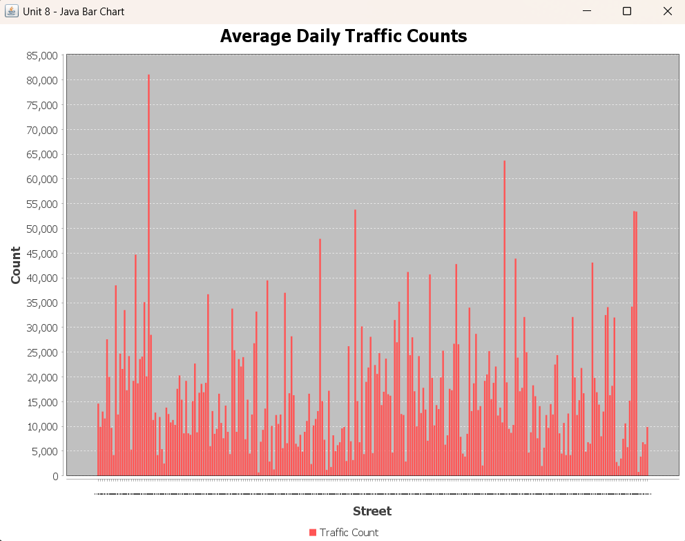

Java Bar Chart Basic

A foundational Java project demonstrating CSV parsing and bar chart visualization with JFreeChart, built as part of introductory data analysis coursework.

📊 Bar Chart Output
Below is the bar chart generated using JFreeChart based on values parsed from a CSV file:

🛠️ Project Overview

This project reads a CSV file containing traffic volume data, extracts relevant values, and visualizes them using a bar chart.
It represents an early-stage exercise in Java programming, data parsing, and basic visualization.

The primary goals were:

Learning how to read and process structured data files
Understanding how external libraries (like JFreeChart) integrate into Java projects
Building the foundation for more advanced object-oriented visualization projects

🔍 Features

Reads data from an external CSV file
Parses thousands of rows of traffic count data
Handles invalid or malformed entries gracefully
Uses DefaultCategoryDataset to structure numerical values
Renders a bar chart using JFreeChart
Displays the chart in a simple Swing UI window

🧠 Skills Demonstrated

Java fundamentals: packages, imports, class structure, main entry point
File I/O: BufferedReader, Files.newBufferedReader, and path handling
Data parsing & cleaning: splitting CSV rows, numeric conversion, skipping invalid lines
Visualization: building bar charts using JFreeChart’s API
Dataset preparation: populating chart datasets for rendering
Error handling: resilient operations using try/catch blocks
Version control: organizing and structuring a clean GitHub repository

📁 Project Structure
java-bar-chart-basic/
│
├── src/
│   └── unit8/
│       └── unit8assignment1.java
│
├── screenshots/
│   └── bar_chart.png      (optional but recommended)
│
├── README.md
└── .gitignore             (optional)

▶️ How to Run

Install Java (JDK 17+ recommended)
Add the JFreeChart JAR to your project classpath
Open the project in Eclipse, IntelliJ, or your preferred IDE
Ensure the CSV file path in main() points to your local copy
Compile and run:
javac unit8assignment1.java
java unit8assignment1
The bar chart window will appear once the data loads.

📦 Technologies Used

Java SE 17+
JFreeChart 1.5.6
Swing (for chart window display)
CSV Text Data

📚 Course Context
This project was created for IN300 – Programming for Data Analysis to introduce
working with large datasets
evaluating data programmatically
producing introductory visualizations
It serves as the foundation for a more advanced, refactored, object-oriented version of the project.

🔮 Next Steps (Advanced Version)
The enhanced version will include:
Modular design (DatasetLoader, ChartBuilder, etc.)
Cleaner separation of concerns
Reusable visualization components
Additional chart types (scatter plots, line charts)
Optional GUI improvements

A separate repository will be created to showcase the improved architecture.
